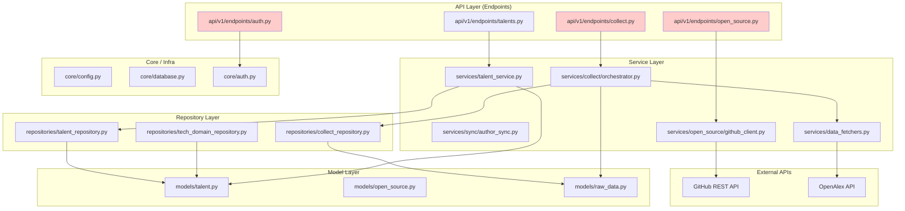

# 阶段1：项目结构全景与依赖关系图

> 扫描时间：2026-05-05  
> 扫描范围：`backend/app/` (~182 .py) + `frontend/src/` (~60 .ts/.tsx)  
> 方法：静态 import 分析 + 分层合规检查

---

## 一、模块职能映射

### 后端 (`backend/app/`)

| 目录 | 职能 | 代表性文件 |
|------|------|-----------|
| `api/v1/endpoints/` | HTTP 请求处理、Pydantic 参数校验 | `open_source.py`, `collect.py`, `talents.py` |
| `services/` | 业务逻辑编排 | `talent_service.py`, `collect/orchestrator.py`, `sync/author_sync.py` |
| `repositories/` | 数据库查询与操作 | `talent_repository.py`, `tech_domain_repository.py` |
| `builders/` | ETL/数据转换（SearchBuilder, StatBuilder） | `search_builder.py`, `stat_builder.py` |
| `models/` | SQLAlchemy ORM 模型 | `talent.py`, `open_source.py`, `raw_data.py` |
| `schemas/` | Pydantic DTO（请求/响应模型） | `open_source.py`, `common.py` |
| `core/` | 核心基础设施 | `config.py`, `database.py`, `auth.py`, `cache.py` |
| `middleware/` | 限流、请求日志、指标采集 | `rate_limit.py`, `request_logging.py` |
| `constants/` | 业务常量 | `countries.py`, `role_type.py` |
| `modules/` | 扩展模块 | （内容待深入） |

### 前端 (`frontend/src/`)

| 目录 | 职能 | 代表性文件 |
|------|------|-----------|
| `pages/` | 页面级组件 | `academic-home-page.tsx`, `open-source-page.tsx` |
| `components/` | 可复用组件 | `talent-card.tsx`, `search-filters.tsx`, `pagination.tsx` |
| `services/` | API 客户端 | `api.ts` |
| `stores/` | Zustand 状态管理 | `authStore.ts`, `favoritesStore.ts` |
| `hooks/` | 自定义 React Hooks | `useQueries.ts` |
| `types/` | TypeScript 类型定义 | `index.ts` |
| `theme/` | 双域主题配置 | `index.ts` |
| `layouts/` | 全局布局 | `MainLayout.tsx` |
| `constants/` | 前端常量 | `index.ts` |
| `utils/` | 工具函数 | `index.ts` |

---

## 二、依赖关系图（Mermaid）

### 后端分层架构



> 🔴 **红色节点**：存在跨层穿透（详见下文"架构违规"）

---

## 三、架构违规清单

### 🔴 跨层穿透（P0）

| # | 违规类型 | 源文件 | 目标 | 行号 | 说明 |
|---|---------|--------|------|------|------|
| 1 | Endpoint → Model | [`api/v1/endpoints/open_source.py`](../../backend/app/api/v1/endpoints/open_source.py) | `models/open_source` | L22 | Endpoint 直接导入 ORM 模型，绕过 Service/Repository |
| 2 | Endpoint → Model | [`api/v1/endpoints/open_source.py`](../../backend/app/api/v1/endpoints/open_source.py) | `models/enums` | L21 | 同上，直接导入枚举类型 |
| 3 | Endpoint → Model | [`api/v1/endpoints/auth.py`](../../backend/app/api/v1/endpoints/auth.py) | `models/enums` | L23 | 同上 |
| 4 | Endpoint → Model | [`api/v1/endpoints/permissions.py`](../../backend/app/api/v1/endpoints/permissions.py) | `models/enums` | L15 | 同上 |
| 5 | Endpoint → Collector | [`api/v1/endpoints/collect.py`](../../backend/app/api/v1/endpoints/collect.py) | `services/collect/orchestrator` | L94, L657 | Endpoint 直接导入采集编排器（Builder/Collector 层），绕过 Service |
| 6 | Endpoint → Collector | [`api/v1/endpoints/open_source.py`](../../backend/app/api/v1/endpoints/open_source.py) | `services/open_source/collectors/github_collector` | L63 | Endpoint 直接导入 GitHub Collector，绕过 Service |

**修复建议**：
- `models/enums` 的使用应在 Endpoint 中通过 `schemas` 或 `services` 间接访问
- Collector/Builder 类不应被 Endpoint 直接调用，应通过专门的 Service 封装

### 🟡 循环依赖（P1）

| 检测结果 | 说明 |
|---------|------|
| **未发现** | 静态 import 扫描未发现 A→B→A 式的循环依赖 |

**备注**：
- [`api/v1/endpoints/collect.py`](../../backend/app/api/v1/endpoints/collect.py) 在函数内部使用延迟导入（L94, L657：`from app.services.collect.orchestrator import CollectionOrchestrator`），这通常是避免循环依赖的 workaround。虽然当前未触发循环，但建议通过 Service 层封装来消除延迟导入的必要性。

### 🟢 基础设施泄露（P2）

| 检测项 | 结果 |
|--------|------|
| 前端直接调用 `fetch()` 或 `axios()` | ❌ 未发现（所有 API 调用通过 `services/api.ts`） |
| 前端硬编码后端 API URL | ❌ 未发现（通过 `import.meta.env.VITE_API_URL`） |
| 前端硬编码 GitHub API URL | ❌ 未发现（`github.com` 仅出现在 `<a href>` 外链中） |
| 后端业务逻辑硬编码 API Endpoint | ⚠️ 部分（见下表） |

| 文件 | 硬编码内容 | 行号 | 评估 |
|------|-----------|------|------|
| [`core/config.py`](../../backend/app/core/config.py) | `GITHUB_BASE_URL: str = "https://api.github.com"` | L36 | ✅ 配置层默认值，可接受 |
| [`services/config_service.py`](../../backend/app/services/config_service.py) | `"https://api.github.com"` | L63, L482 | ⚠️ 与配置层重复定义，建议统一 |

**补充发现**：`httpx.AsyncClient` 未通过统一工厂创建

| 文件 | 行号 | 说明 |
|------|------|------|
| [`services/openalex_client.py`](../../backend/app/services/openalex_client.py) | L180, L223, L262, L275, L288 | 直接 `async with httpx.AsyncClient(...)`，未使用 `HttpClientFactory` |
| [`api/v1/endpoints/system_config.py`](../../backend/app/api/v1/endpoints/system_config.py) | L656, L746, L887 | 同上，直接创建 client（且位于 Endpoint 层，双重违规） |

> `services/open_source/github_client.py` 合规：通过 `HttpClientFactory.create_client_for_url(...)` 创建。

### 🟢 前端命名风格（补充）

| 命名风格 | 出现位置 | 示例 | 评估 |
|----------|---------|------|------|
| **camelCase** | 前端变量、函数、Hooks | `favoriteIds`, `handleSearch`, `useColumnConfig` | ✅ 前端主导风格 |
| **PascalCase** | TypeScript 类型/接口、组件 | `interface TalentDetail`, `const FavoriteButton: React.FC` | ✅ 类型与组件规范 |
| **snake_case** | API DTO 字段（映射后端） | `talent_id`, `created_at`, `page_size` | ✅ 后端数据契约映射 |
| **UPPER_SNAKE_CASE** | 全局常量映射表 | `ROLE_TYPE_MAP`, `TIME_RANGE_CONFIG` | ✅ 常量规范 |
| **混合风格** | — | 未发现 | ✅ 无违规 |

**结论**：前端存在 3 种命名风格，但属于**有意识的领域分层**（前端运行时 camelCase + 类型系统 PascalCase + 后端数据契约 snake_case），并非命名混乱。未发现 `user_Name` 之类的混合风格。

---

## 四、分层合规总览

```
理想分层：Endpoint → Service → Repository → Model
实际分层：

  API (Endpoints)     ← 直接访问 Models (4处)
       ↓
  Service             ← 直接访问 External APIs
       ↓
  Repository          ← 合规，无 Service 依赖
       ↓
  Model

  Builders/Collectors ← 被 Endpoints 直接调用 (2处)
```

**合规评分**：7/10（跨层穿透存在，但 Repository 层保持纯净，无循环依赖）

---

## 五、待深入项

- [ ] `frontend/src/` 各目录下的具体文件列表和职责
- [ ] `backend/app/modules/` 目录的具体用途
- [ ] 前端是否存在组件间循环依赖（需解析 TS import graph）

---

> 下一步：等待用户确认后，进入阶段2「代码异味热力图扫描」。
