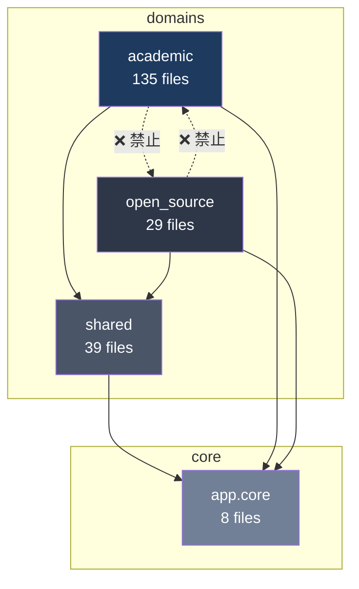
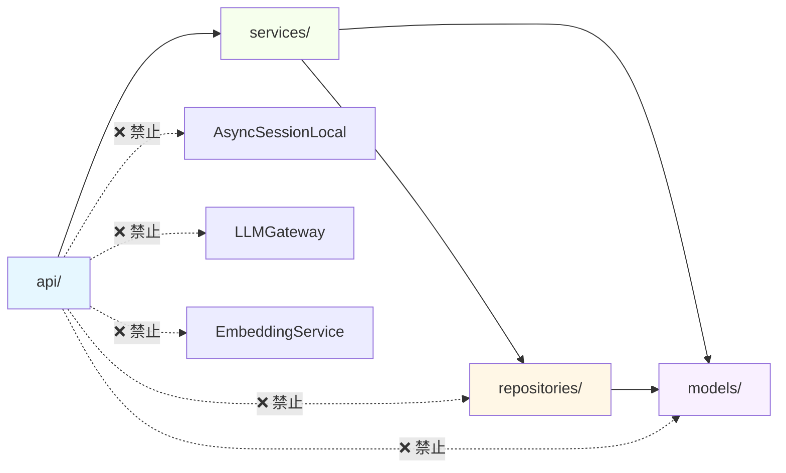

# Phase 1: 项目结构全景与依赖关系图 (v2.0.2 全面审计)

> 审计时间：2026-05-15
> 基于 commit: `4637977` (v2.0.2 + 安全加固)

---

## 1. 项目模块总览

### 后端

| 模块 | 文件数 | 估计代码行数 | 职能 |
|------|--------|-------------|------|
| `backend/app/domains/academic/` | 135 | ~24,589 | 学术人才域 — 采集/标准化/同步/搜索/推荐/JD匹配/嵌入 |
| `backend/app/domains/open_source/` | 29 | ~5,905 | 开源人才域 — GitHub采集/开发者查询/收藏/仓库配置 |
| `backend/app/domains/shared/` | 39 | ~7,714 | 共享基础设施 — 认证/审计/缓存/LLM/配置/用户管理 |
| `backend/app/core/` | 8 | ~1,275 | 核心层 — 数据库/配置/异常/日志/指标/认证工具 |
| `backend/app/middleware/` | 4 | ~400 | 全局中间件 — 限流/请求日志/Prometheus指标 |
| **后端合计** | **~215** | **~39,883** | |

### 前端

| 模块 | 文件数 | 估计代码行数 | 职能 |
|------|--------|-------------|------|
| `frontend/src/pages/` | 34 | ~11,041 | 页面级组件（按业务域组织） |
| `frontend/src/components/` | 7 | ~855 | 全局可复用组件 |
| `frontend/src/services/` | 5 | ~535 | API 客户端层（Axios封装） |
| `frontend/src/stores/` | 3 | ~242 | Zustand 状态管理 |
| `frontend/src/hooks/` | 6 | ~500 | 自定义 React Hooks |
| `frontend/src/contexts/` | 2 | ~150 | React Context 兼容层（已弃用） |
| `frontend/src/types/` | 1 | ~534 | TypeScript 类型定义 |
| `frontend/src/theme/` | 1 | ~200 | 主题系统 + semanticColors |
| `frontend/src/utils/` | 5 | ~300 | 工具函数 |
| **前端合计** | **~64** | **~14,357** | |

---

## 2. 后端域间依赖关系



**规则**: academic ↔ open_source 不可互引，仅通过 shared 通信。
**实际检测结果: ✅ CLEAN** — 零跨域导入违规。

---

## 3. 层级依赖关系



---

## 4. 架构违规清单

### 🔴 Endpoint 层级穿透 (3处)

| # | 文件 | 行号 | 违规导入 | 类型 | 说明 |
|---|------|------|----------|------|------|
| 1 | `academic/api/talents.py` | 507 | `AsyncSessionLocal` | Session工厂直引 | `run_sync_background()` 延迟导入 Session 工厂，触碰底层 |
| 2 | `academic/api/embeddings.py` | 15 | `EmbeddingDomainService` | EmbeddingService 直引 | 语义上属于同域 Service，**【需人工复核】** |
| 3 | `open_source/api/auth.py` | — | 重复实现认证 | 安全漏洞 | 自行实现 `get_current_user()`，不校验 DB 用户存在性和 `is_active`，与 `shared/api/auth.py` 功能重复且更弱 |

### 🟡 API 层直接访问 Service 内部状态 (2处)

| # | 文件 | 行号 | 访问对象 |
|---|------|------|----------|
| 1 | `open_source/api/collection.py` | 22 | `background_state.cancelled_task_ids` |
| 2 | `open_source/api/stats.py` | 24 | `background_state.embedding_progress` |

### 🟡 HTTP 客户端白名单外使用 (1处)

| # | 文件 | 行号 | 导入 | 状态 |
|---|------|------|------|------|
| 1 | `shared/services/system_config_test_service.py` | 277 | `import httpx` | ⚠️ 不在白名单，被 CI 基线容忍 |

### ✅ 无违规项

| 检查项 | 结果 |
|--------|------|
| 跨域导入 (academic ↔ open_source) | ✅ CLEAN |
| 循环依赖 | ✅ CLEAN（全模块图无环） |
| shared → domain 反向依赖 | ✅ CLEAN |
| 前端基础设施泄露 (直接 fetch/axios) | ✅ CLEAN |
| API 不直接导入 Repository | ✅ CLEAN |
| API 不直接导入 LLM/Embedding/Client | ✅ CLEAN (embeddings.py 待复核) |
| API 不直接导入同域 Models | ✅ CLEAN |

---

## 5. 前端架构

```
frontend/src/
├── pages/          → 按业务域组织页面 ✅ 通过 services/api/ 调后端
├── components/     → 全局可复用组件 ✅ 通过 services/api/ 调后端
├── stores/         → Zustand (auth + favorites + domain)
├── contexts/       → AuthContext + FavoritesContext (兼容层，已弃用)
├── services/api/   → 统一 API 客户端层
│   ├── client.ts   → Axios 实例 + 拦截器
│   ├── academic.ts → 学术域 API
│   ├── openSource.ts → 开源域 API
│   └── shared.ts   → 共享 API
├── hooks/          → React Query 封装 + 自定义 hooks
├── theme/          → semanticColors 设计系统
└── utils/          → 工具函数
```

**潜在问题**: `contexts/` (AuthContext, FavoritesContext) 与 `stores/` (authStore, favoritesStore) 职责重叠，Context 层已退化为 no-op 代理，建议移除。

---

## 6. 关键架构变化（v2.0.1 → v2.0.2）

| 维度 | v2.0.1 | v2.0.2 | 变化 |
|------|--------|--------|------|
| Endpoint 违规 | 7 处 | 3 处 | ⬇ 57% |
| system_config 直引 httpx | 4 处 | 0 | ✅ 清零 |
| 跨域隔离 | 0 | 0 | — |
| 循环依赖 | 0 | 0 | — |
