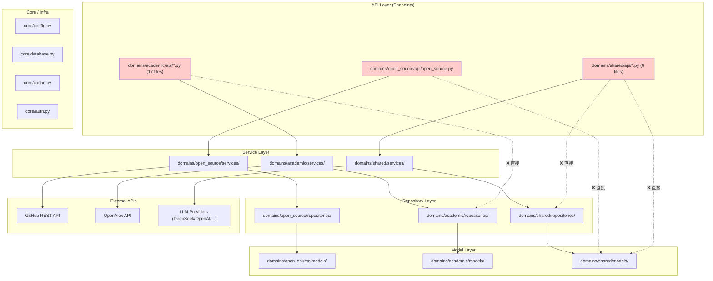

# 阶段1：项目结构全景与依赖关系图 (v2.0.0 更新)

> 扫描时间：2026-05-09
> 扫描范围：`backend/app/` (~120 .py 源文件) + `frontend/src/` (~60 .ts/.tsx)
> 方法：静态 import 分析 + 分层合规检查
> 更新说明：基于 domain-driven 架构重新分析（旧版报告使用了已废弃的扁平路径）

---

## 一、模块职能映射

### 后端 (`backend/app/`)

| 目录 | 职能 | 代表性文件 |
|------|------|-----------|
| `core/` | 核心基础设施 | `config.py`, `database.py`, `auth.py`, `cache.py`, `exceptions.py`, `logging_config.py`, `metrics.py` |
| `middleware/` | 中间件层 | `rate_limit.py`, `request_logging.py`, `metrics.py` |
| `model_registry.py` | SQLAlchemy 模型注册 | 统一导入所有 ORM 模型供 Alembic 使用 |
| `api_router.py` | API 路由聚合 | 汇总所有域的路由器 |
| `domains/academic/` | 学术人才域 | api, models, schemas, repositories, services |
| `domains/open_source/` | 开源人才域 (v2.0) | api, models, schemas, repositories, services |
| `domains/shared/` | 共享基础设施域 | api (auth/audit/health/metrics/permissions/system_config), models, services (cache/llm/common/config) |

| 学术人才域 sub 结构 | 职能 |
|-----|------|
| `academic/api/` | 17 个 FastAPI router 模块 |
| `academic/models/` | SQLAlchemy ORM (raw_data, standardized, talent, school, venue, embedding, jd_match, collaboration, sync, statistics, search, tech_domain) |
| `academic/schemas/` | Pydantic DTOs (collect, filters, homepage, overview, talent_pool, tech_domain, venue, v1_4, data_version) |
| `academic/repositories/` | 数据库操作层 (talent 子包拆分为 base/search/export) |
| `academic/services/` | 业务逻辑 (collect 流水线 11 阶段, embedding, jd_match, normalizers, recommend, search 策略模式, sync) |
| `academic/builders/` | 查询构建器 (search_builder, stat_builder) |
| `academic/constants/` | 业务常量 (countries, role_type, collect_task) |

| 开源人才域 sub 结构 | 职能 |
|-----|------|
| `open_source/api/` | 1 个聚合 router (997行，含 developers/repos/contributions/collect/search/export/embedding) |
| `open_source/models/` | ORM (os_developer, os_repository, os_contribution, os_collect_task, os_repo_config 等) |
| `open_source/schemas/` | Pydantic DTOs (441行) |
| `open_source/repositories/` | 数据库操作 (1002行) |
| `open_source/services/` | collectors/github_collector, github_client, open_source_service (1398行), open_source_embedding_service, sync_service |

### 前端 (`frontend/src/`)

| 目录 | 职能 | 代表性文件 |
|------|------|-----------|
| `pages/` | 按领域分组的页面组件 | academic/, open-source/, admin/, auth/, user/, system-config/, competition/, industry/ |
| `components/` | 可复用组件 | FavoriteButton, TopicTags, TalentCompareModal, AILoadingOverlay, ColumnSettings, CollaborationGraph |
| `services/api/` | API 客户端（按域拆分） | client.ts, academic.ts, openSource.ts, shared.ts |
| `stores/` | Zustand 状态管理 | authStore.ts, favoritesStore.ts, domainStore.ts |
| `hooks/` | React Hooks | useQueries.ts, useColumnConfig.ts, useKeyboardShortcuts.ts, useSearchTemplates.ts |
| `types/` | TypeScript 类型定义 | index.ts (546行) |
| `theme/` | 双域主题配置 | index.ts |
| `layouts/` | 全局布局 | MainLayout.tsx |
| `constants/` | 常量映射 | index.ts, collectTask.ts, followupStatus.ts, roleType.ts |
| `utils/` | 工具函数 | index.ts, format.ts, datetime.ts |

---

## 二、当前依赖关系图（Mermaid）



---

## 三、当前架构违规清单

### 🔴 跨层穿透 — API 层直接访问 Repository/Model（共 15 处）

| # | 违规类型 | 源文件 | 目标 | 说明 |
|---|---------|--------|------|------|
| 1 | Endpoint → Repository | `academic/api/overview.py:10` | `repositories/stat_repository` | 直接导入 StatisticsRepository |
| 2 | Endpoint → Repository | `academic/api/venue.py:13` | `repositories/venue_repository` | 直接导入 VenueRepository |
| 3 | Endpoint → Repository | `academic/api/talents.py:136` | `repositories/talent_repository` | 延迟导入 TalentRepository |
| 4 | Endpoint → Repository | `academic/api/countries.py:12` | `repositories/school_repository` | 直接导入 SchoolRepository |
| 5 | Endpoint → Repository | `academic/api/homepage.py:13` | `repositories/homepage_repository` | 直接导入 HomepageRepository |
| 6 | Endpoint → Repository | `academic/api/favorites.py:13` | `repositories/favorite_repository` | 直接导入 FavoriteRepository |
| 7 | Endpoint → Repository | `academic/api/tech_domain.py:13` | `repositories/tech_domain_repository` | 直接导入 TechDomainRepository |
| 8 | Endpoint → Repository | `academic/api/schools.py:12-13` | `repositories/school_repository`, `talent_repository` | 直接导入 2 个 Repository |
| 9 | Endpoint → Repository | `academic/api/talent_pool.py:10` | `repositories/talent_pool_repository` | 直接导入 TalentPoolRepository |
| 10 | Endpoint → Repository | `shared/api/permissions.py:15` | `repositories/user_repository` | 直接导入 UserRepository |
| 11 | Endpoint → Model | `shared/api/permissions.py:18` | `models/enums` | 直接导入 UserRoleType |
| 12 | Endpoint → Repository | `shared/api/auth.py:23` | `repositories/user_repository` | 直接导入 UserRepository |
| 13 | Endpoint → Model | `shared/api/auth.py:26` | `models/enums` | 直接导入 UserRoleType |
| 14 | Endpoint → Repository | `shared/api/audit.py:15` | `repositories/audit_repository` | 直接导入 AuditRepository |
| 15 | Endpoint → Model | `open_source/api/open_source.py:52` | `shared/models/enums` | 直接导入 UserRoleType |

> **v2.0.0 已修复**: `search.py`, `collect.py`, `embeddings.py` 共 13 项已治理（参见 CHANGELOG）。
> **v2.0.1 计划**: 修复上述剩余 15 项。

### 🟡 其他架构问题

| # | 问题 | 位置 | 风险 |
|---|------|------|------|
| 1 | `openalex_client.py` 未使用 `HttpClientFactory` 创建 client | L180+ | 无法复用代理配置和连接池 |
| 2 | `open_source/api/open_source.py` 997行单文件聚合全部路由 | 整个文件 | 应拆分为 developers/repos/collect/search 等子模块 |
| 3 | README.md 架构图仍为旧扁平结构 | README L38-61 | 与当前 domain-driven 架构不一致 |

### 🟢 正面发现

- **无循环依赖**：所有域之间通过 shared 域单向依赖
- **Repository 层纯净**：Repository 只依赖 Model，不依赖 Service
- **前端无基础设施泄露**：所有 API 调用通过 `services/api/` 统一封装
- **命名风格统一**：后端 snake_case + PascalCase，前端 camelCase + PascalCase + snake_case(API契约)，均为有意识分层

---

## 四、分层合规总览

```
理想分层：Endpoint → Service → Repository → Model
v2.0.0 实际分层：

  API (Endpoints)     ← 15处直接访问 Repository/Model（相比 v1.x 的 19处 已减少）
       ↓
  Service             ← 正确封装业务逻辑
       ↓
  Repository          ← 合规，无反向依赖 ✅
       ↓
  Model

  前端: Page → Hook/Store → API Client → Backend  ✅ 分层清晰
```

**架构合规评分**：**13/20**（v2.0.0 已治理 13 项，剩余 15 项跨层穿透待治理）

---

## 五、第三方依赖健康度

| 依赖 | 版本 | 用途 | 评估 |
|------|------|------|------|
| fastapi | 0.115.0 | Web 框架 | ✅ 核心依赖 |
| sqlalchemy | 2.0.35 | ORM | ✅ 核心依赖 |
| httpx | 0.27.2 | HTTP 客户端 | ✅ 用于外部 API 调用 |
| tenacity | 9.0.0 | 重试库 | ✅ 多处使用 |
| redis | 5.2.0 | 缓存 | ⚠️ 可选，开发环境默认关闭 |
| openai | >=1.0.0 | LLM SDK | ⚠️ 仅用于 LLM gateway，非所有部署需要 |
| tiktoken | >=0.5.0 | Token 计数 | ⚠️ 仅用于 LLM |
| numpy | >=1.24.0 | 数值计算 | ⚠️ 仅用于向量计算 |
| aiohttp | >=3.9.0 | 异步 HTTP | ⚠️ 与 httpx 功能重叠，建议统一 |
| bcrypt | 4.2.0 | 密码哈希 | ✅ 安全必需 |
| openpyxl | 3.1.2 | Excel 导出 | ✅ 业务需要 |

> **建议**: `aiohttp` 与 `httpx` 功能重叠，考虑统一为 `httpx`（已用于 GitHub client）。`openai` SDK 使用范围有限，可考虑改为可选依赖。

---

> 关联报告：[02-code-smell-heatmap.md](02-code-smell-heatmap.md) | [03-ai-style-markers.md](03-ai-style-markers.md) | [04-pipeline-resilience.md](04-pipeline-resilience.md)
