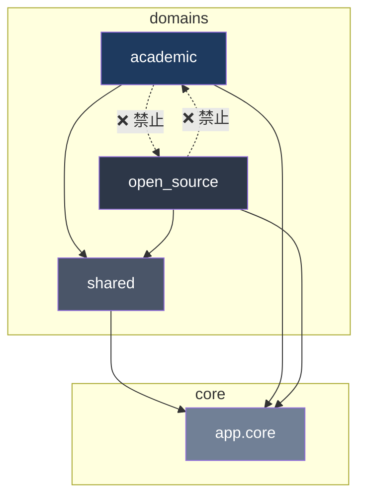
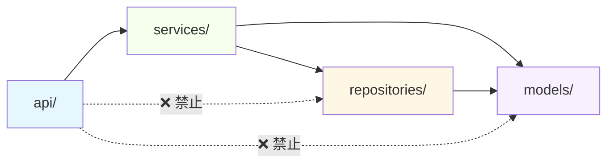

# Phase 1: 项目结构全景与依赖关系图 (v2.0.1 更新)

> 扫描时间：2026-05-12

## 1. 项目模块总览

| 模块 | 文件数 | 代码行数 | 职能 |
|------|--------|----------|------|
| `backend/app/domains/academic/` | 135 | 24,589 | 学术人才域 — 采集/标准化/同步/搜索/推荐/JD匹配 |
| `backend/app/domains/open_source/` | 29 | 5,905 | 开源人才域 — GitHub采集/开发者查询/收藏 |
| `backend/app/domains/shared/` | 39 | 7,714 | 共享基础设施 — 认证/审计/缓存/LLM/配置 |
| `backend/app/core/` | 8 | 1,275 | 核心层 — 数据库/配置/异常/日志 |
| `frontend/src/pages/` | 34 | 11,041 | 页面组件 |
| `frontend/src/components/` | 7 | 855 | 通用组件 |
| `frontend/src/stores/` | 3 | 242 | 状态管理 (Zustand) |
| `frontend/src/services/` | 5 | 535 | API 客户端层 |
| `scripts/` | 6 | 257 | 运维/CI 脚本 |
| **合计** | **264** | **51,647** | |

> 学术域占后端 51%，是最核心也最复杂的模块。

## 2. 后端域间依赖关系



**规则**: academic ↔ open_source 不可互引，仅通过 shared 通信。
**实际检测结果: ✅ CLEAN** — 零跨域导入违规。

## 3. 层级依赖关系（以 academic 为例）



**规则**: API → Service → Repository/Model，API 不得穿透到 Repository/Model/LLM/Embedding/Client。
**实际检测结果: ⚠️ 7处违规**

## 4. 架构违规清单

### 🔴 Endpoint 层级穿透 (7处)

| # | 文件 | 行号 | 违规导入 | 类型 |
|---|------|------|----------|------|
| 2a | `academic/api/embeddings.py` | 15 | `EmbeddingDomainService` | EmbeddingService 直引 |
| 2b | `academic/api/jd_match.py` | 25 | `EmptyJDError, LLMError` | LLM 模块直引 |
| 2c | `academic/api/recommend.py` | 21 | `RecommendError` | LLM 模块直引 |
| 2d | `shared/api/system_config.py` | 304 | `HttpClientFactory` | HTTP 客户端直引 |
| 2e | `shared/api/system_config.py` | 359 | `HttpClientFactory` | HTTP 客户端直引 |
| 2f | `shared/api/system_config.py` | 615 | `HttpClientFactory` | HTTP 客户端直引 |
| 2g | `shared/api/system_config.py` | 357 | `import httpx` | 直接 httpx 导入 |

> 注: 2d-2g 均在 `system_config.py` 的 test-proxy/test-github 端点中，该文件已被架构基线收录但新增的 `import httpx` 是 v2.0 引入的新违规。

### ✅ 无违规项

| 检查项 | 结果 |
|--------|------|
| 跨域导入 (academic ↔ open_source) | CLEAN |
| HTTP 客户端基线外违规 | CLEAN (全部在基线内) |
| shared → domain 反向依赖 | CLEAN |
| 前端基础设施泄露 (直接 fetch/axios) | CLEAN |

## 5. 前端架构

```
frontend/src/
├── pages/          → 通过 services/api/ 调后端 ✅
├── components/     → 通过 services/api/ 调后端 ✅
├── stores/         → Zustand (domain + auth + favorites)
├── contexts/       → AuthContext + FavoritesContext (旧模式，与 stores 重叠)
├── services/api/   → 统一 API 客户端层
├── theme/          → 领域感知主题系统 + semanticColors
├── hooks/          → React Query + 自定义 hooks
└── utils/          → 工具函数
```

**潜在问题**: `contexts/` (AuthContext, FavoritesContext) 与 `stores/` (authStore, favoritesStore) 存在职责重叠 — 两种状态管理模式并存。
